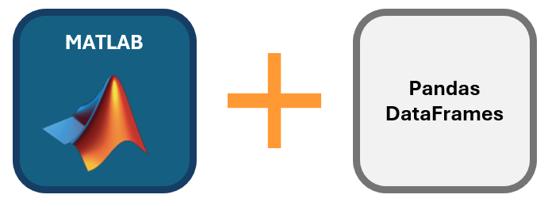
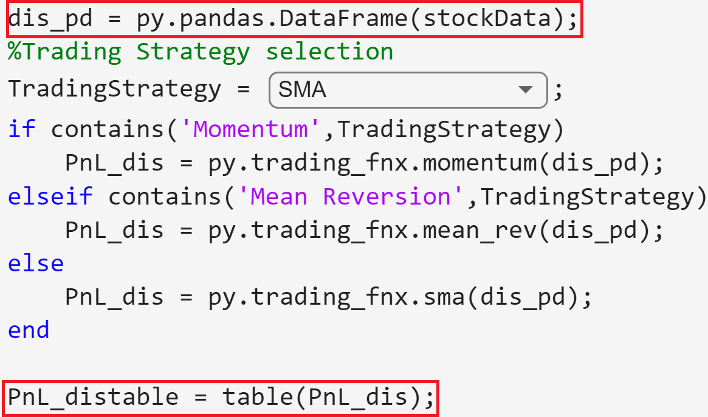
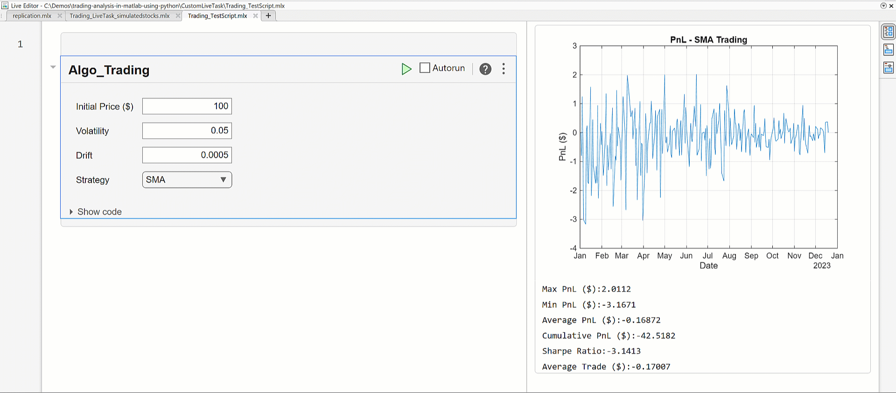
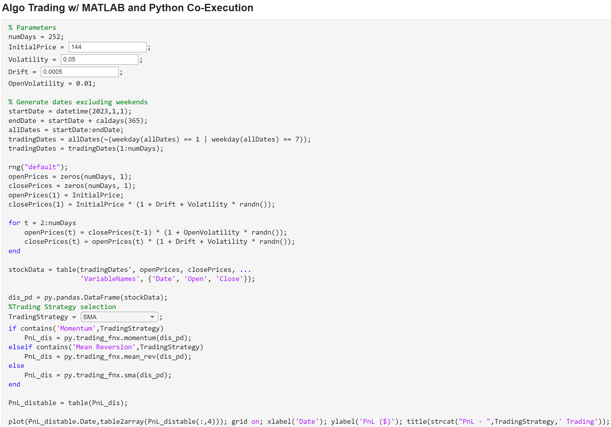
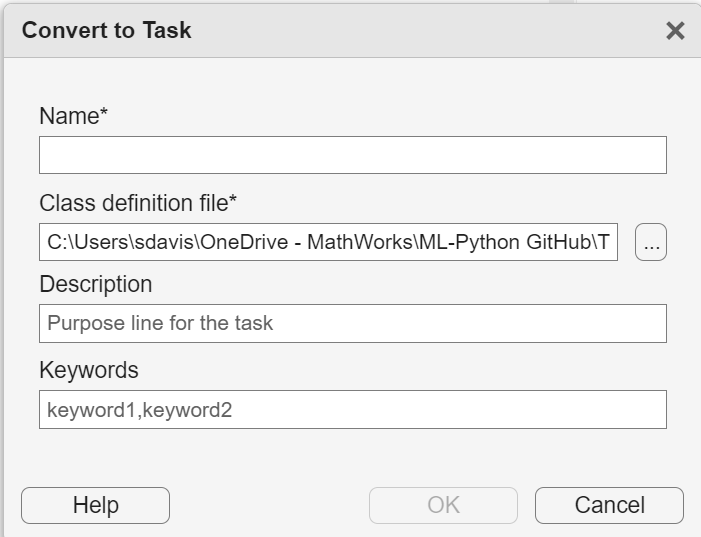
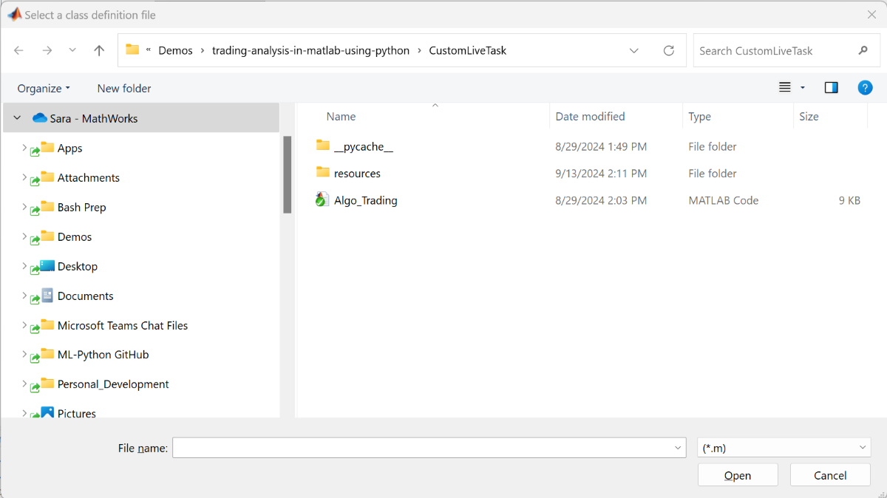
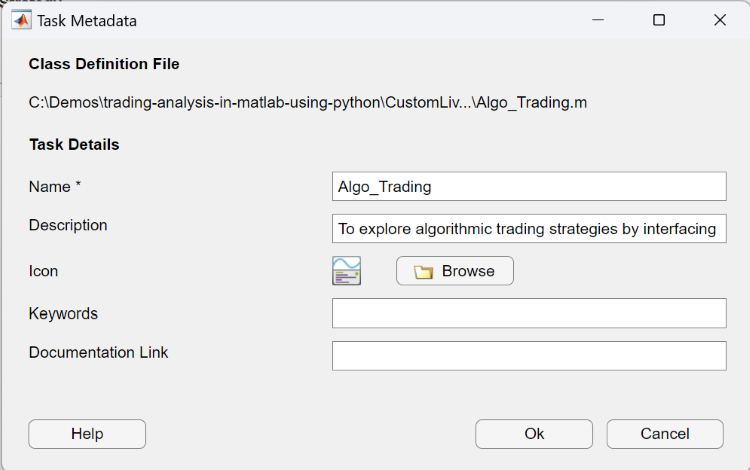
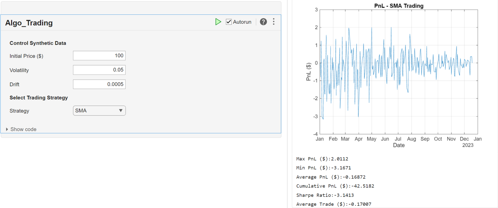

# Trading Analysis in MATLAB using Python DataFrames

This repository demonstrates how MATLAB® and Python® users can collaborate seamlessly to implement and test algorithmic trading strategies through table-to-DataFrame conversion and custom Live Tasks. Co-execution offers a significant time-saving advantage by allowing direct execution of pre-existing Python code alongside MATLAB. In environments where financial developers work across multiple teams, it’s often necessary to interface with or inherit code from both platforms. Recoding between these environments can be time-consuming, costly, and generally impractical. Instead, developers can execute Python code directly within MATLAB and easily convert between pandas DataFrames and MATLAB Tables, simplifying collaboration. This demo showcases how to use co-execution to create a custom Live Task that generates synthetic data in MATLAB tables, converts the tables to Python DataFrames for executing pre-written Python trading strategies, and finally converts the DataFrames back into MATLAB tables for analysis.

# Co-execution Overview and Benefits

Co-execution involves using two frameworks in tandem to create a single, unified application. In this example, data is passed between MATLAB Tables and Python DataFrames using [recent functionality introduced in MATLAB version 2024a](https://www.mathworks.com/help/matlab/matlab_external/python-pandas-dataframes.html). This approach offers several benefits. By interfacing multiple frameworks, development time and costs can be reduced, as teams no longer need to code in the same language. This enables teams to work in their preferred environments, avoiding the need to learn and retool code in unfamiliar languages. Co-executing Python with MATLAB leverages MATLAB's accessible functionality, allowing users to explore the parameter space and fine-tune trading strategies more efficiently.

## MATLAB Tables and Python DataFrames

MATLAB Tables and Python DataFrames are both data structures that are used for organizing and analyzing tabular data. Interfacing between these two is essential when integrating MATLAB with Python workflows, which is now possible through MATLAB version 2024a. Conversion between the two data types is simple and fundamental to the demo in this page. A MATLAB Table can be converted to a Python DataFrame, as well as the reverse, through one line of code, shown in the red boxes in the image below.

# Custom Live Tasks

[Live Tasks](https://www.mathworks.com/help/matlab/matlab_prog/add-live-editor-tasks-to-a-live-script.html) are small graphical user interfaces (GUI) that can be added to [live scripts](https://www.mathworks.com/help/matlab/matlab_prog/what-is-a-live-script-or-function.html) to execute specific MATLAB commands. A variety of Live Tasks are built into MATLAB, ranging from simple operations like plotting and visualization to more complex tasks like optimization. Live Tasks also have the capability to generate reusable code from the parameters that the user selected. In this demo, a custom Live Task provides a GUI that allows the user to explore the free parameters of the demo in a user-friendly way. The Live Task interfaces MATLAB with Python code under the hood. The gif below demonstrates how to use the Live Task, with editable fields and a drop down menu, while viewing the results on the fly.

# Getting started

Download or clone this repository to your machine and open it in MATLAB.

# Setup

Requires:
* [MATLAB version 2024a or later](https://www.mathworks.com/products/matlab.html)
* [Python 3.9+](https://www.python.org/downloads/)

For more information about installing Python to interface with MATLAB, see [Install Supported Python Implementation](https://www.mathworks.com/help/matlab/matlab_external/install-supported-python-implementation.html).

## Custom Live Task Creation

Creating a custom Live Task takes a [few steps](https://www.mathworks.com/help/matlab/creating_guis/create-task-from-selection.html) - the major steps are highlighted below:

1. Write your code in a Live Script
2. [Add interactive controls](https://www.mathworks.com/help/matlab/matlab_prog/add-interactive-controls-to-a-live-script.html) for exploratory parameters in your Live Script. This includes edit fields, dropdown boxes, and other types of controls. The Live Script with interactive controls written for this repo is shown below.

3. Select your code and go to the Live Editor tab in the MATLAB task bar. Click on the "Task" dropdown menu  
    a. Under "Create", click on the "Convert to Live Task" option, as shown below 
     
     

    b. Name your Live Task and click on the OK button. A new .m will appear in the Current Folder.
4. You can use the new Live Task by clicking on the "Task" dropdown menu and selecting it under "My Tasks"

## Using the Algorithmic Trading Live Task

To launch the custom algo trading Live Task in this repo:
* Right-click on the "CustomLiveTask" folder and select "Add to Path" before following any of the setup options below.
* Click on the "CustomLiveTask" folder. You will see three files in the following formats: .m, .py, and .matlab_external
* To install the Live Task to your instance of MATLAB, enter the following command into the Command Window: matlab.task.configureMetadata . Select the "Algo_Trading.m" file in the window below

* A new window will arrive that asks you to specify the details of the Live Task, as shown below. Click "OK" when prompted:

* Open the "Trading_TestScript" Live Script. You will see the algorithmic trading Live Task come up automatically, as shown below

* In total, you will see four parameters that you may alter  
    * Under "Control Synthetic Data", you have three free parameters (Initial Price, Volatility, and Drift) with edit fields that allow you enter numerical values  
    * "Select Trading Strategy" allows you to select one of three trading strategies, which include Mean Reversion, Momentum, and Simple Moving Average  
* The results will change automatically when changing the parameters. On the right hand side, you will see a graph of the PnL, as well as six associated metrics for the trading algorithm's performance.

# Conclusion

The goal of this demo was to show:

* How to smoothly interface MATLAB with Python by seamlessly switching between tables and DataFrames
* What custom Live Tasks are and how to use them
* Build a foundation for finance professionals to integrate Python models with MATLAB's unique functionality and interfacing

# License

The license is available in the License.txt file in this GitHub repository.

# Contact

Sara Galante at sgalante@mathworks.com, Application Engineering

Copyright 2024 The MathWorks, Inc.
